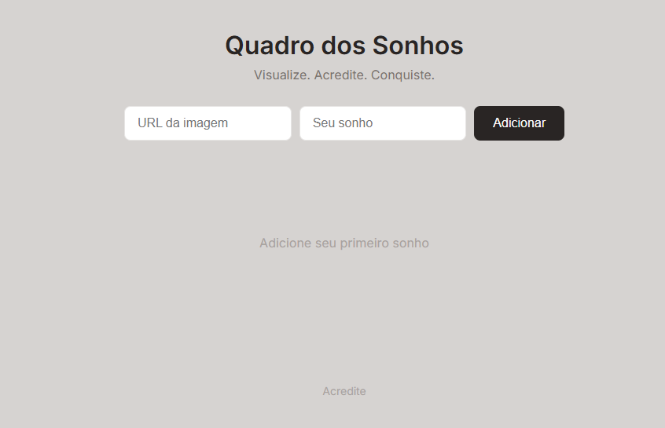

# 🌟 Quadro dos Sonhos (Dream Board)

O **Quadro dos Sonhos** é uma aplicação web simples e inspiradora desenvolvida para ajudar usuários a visualizarem seus objetivos. Através de uma interface intuitiva, é possível adicionar imagens e descrições dos seus sonhos, criando um mural visual de motivação.

> "Visualize. Acredite. Conquiste."

---

## 🚀 Funcionalidades

* **Adicionar Sonhos:** Insira o link de uma imagem e uma descrição personalizada.
* **Visualização Dinâmica:** Os sonhos são exibidos em um layout de cards.
* **Interface Responsiva:** Design limpo e focado na experiência do usuário.

## 🛠️ Tecnologias Utilizadas

Este projeto foi construído utilizando as seguintes tecnologias:

* **HTML5:** Estruturação dos elementos.
* **CSS3:** Estilização e layout.
* **JavaScript:** Lógica para manipulação dinâmica de conteúdo.

## 📸 Demonstração



## 💻 Como rodar o projeto

1.  Clone este repositório:
    ```bash
    git clone [https://github.com/vinicius311006/quadro-dos--sonhos.git](https://github.com/vinicius311006/quadro-dos--sonhos.git)
    ```
2.  Acesse a pasta do projeto:
    ```bash
    cd quadro-dos--sonhos
    ```
3.  Abra o arquivo `index.html` no seu navegador.

---

## 📄 Licença

Este projeto está sob a licença MIT. 

---
Desenvolvido com ❤️ por [Vinicius](https://github.com/vinicius311006)
